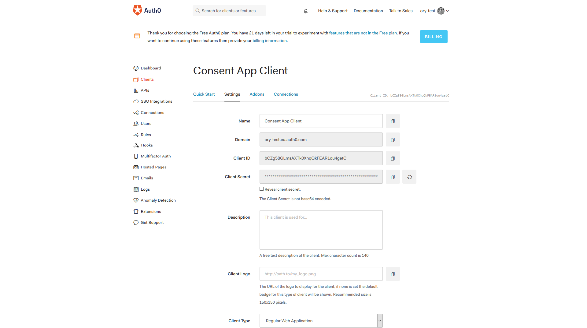

# hydra-consent-app-auth0

# THIS REPOSITORY IS DEPRECATED

This repository contains a library and an exemplary express application that connects ORY Hydra with Auth0.

[](https://circleci.com/gh/ory/hydra-auth0-consent-sdk)

<!-- START doctoc generated TOC please keep comment here to allow auto update -->
<!-- DON'T EDIT THIS SECTION, INSTEAD RE-RUN doctoc TO UPDATE -->


- [Introduction](#introduction)
  - [Setting up Auth0](#setting-up-auth0)
  - [Running the Demo](#running-the-demo)
- [Docs](#docs)
  - [SDK](#sdk)
    - [](#)
  - [Example App](#example-app)

<!-- END doctoc generated TOC please keep comment here to allow auto update -->

## Introduction

### Setting up Auth0

Once you create an Auth0 account and an Auth0 tenant, you need to create a new client that the consent app will use
to connect to Auth0.


Once created, go to the *Settings* tab and use the client ID, client secret and domain fields to populate the environment
variables `AUTH0_CLIENT_ID`, `AUTH0_CLIENT_SECRET`, `AUTH0_DOMAIN`.



To get this specific demo working, you also need to add a callback url pointing to `http://localhost:4446/auth/callback`,
as that is the callback url the Docker demo is using.


### Running the Demo

Now that you have set the environment variables it is time to run the demo. Make sure to have `docker` and `docker-compose`
installed, then run:

```
docker-compose -p auth0consent up --build
```

Once all the services are booted, use the following CLI command to perform the OAuth 2.0 authorize code flow.

```
$ docker rm -f auth0consent_hydra_token; docker run \
    --name auth0consent_hydra_token \
    --rm \
    -p 4445:4445 \
    --network auth0consent_subnet \
    oryd/hydra:v0.10.0-alpha.18 \
    token user \
        --auth-url=http://localhost:4444/oauth2/auth \
        --token-url=http://hydra:4444/oauth2/token \
        --id root \
        --secret secret \
        --no-open \
        --scopes offline,openid
```

## Docs

This repository has two packages, [`ory-hydra-auth0-consent-sdk`](https://www.npmjs.com/package/ory-hydra-auth0-consent-sdk)
which contains a few helpers to deal with the consent flow, and an exemplary app.

You may use the example app as guidance, or fork it to create your own consent app.

### SDK

First we need to initialize passport, luckily the SDK provides a helper for that:

```js
var consent = require('ory-hydra-consent-sdk');
var winston = require('winston'); // We recommend using winston for logging

var initializePassport = consent.initializePassport;

initializePassport(passport, winston)
```

To get the SDK working in an express app, we have to load certain express middleware, such as a body parser, a session middleware,
passport middleware, and so on. To make this as easy as possible, a helper is provided that can solve this for you:

```js
var express = require('express');
var consent = require('ory-hydra-consent-sdk');

var initializeMiddleware = consent.initializeMiddleware;
var app = express();

app.use(logger('dev')); // Load some middlewares, such as request logging
app.use(express.static(path.join(__dirname, '..', 'public'))); // Or static file serving

initializeMiddleware(app, passport); // Loads the required middlewares for the SDK to work
```

Once everything is initialized, it is time to define the login, callback and consent routes. For an example of
how to do that, please browse [this documented source file](./example/routes/index.js).

####


### Example App

The example app supports the following environments for configuration:

| Environment variable | Description | Required | Default |
| -- | -- | -- | -- |
| AUTH0_CLIENT_ID | The Auth0 Client ID | Yes | `` |
| AUTH0_CLIENT_SECRET | The Auth0 Client Secret | Yes | `` |
| AUTH0_DOMAIN | The Auth0 Domain | Yes | `` |
| AUTH0_CALLBACK_URL | The callback url of your consent app, which must be whitelisted in the Auth0 client setting | Yes | `` |
| HYDRA_CLIENT_ID | The OAuth 2.0 Client ID capable of accessing ORY Hydra's `/oauth2/consent/requests` endpoint | Yes | `` |
| HYDRA_CLIENT_Secret | The OAuth 2.0 Client secret for access ORY Hydra | Yes | `` |
| HYDRA_URL | The URL of ORY Hydra | Yes | `` |
| COOKIE_SECRET | The secret used to encrypt session values | No | `uuid.v4()` |
| DEFAULT_REDIRECT_URL | Allows the user to continue when an error occurs | No | `` |
| LOG_LEVEL | Set this to `debug` for seeing what is going on in your app | No | `info` |
